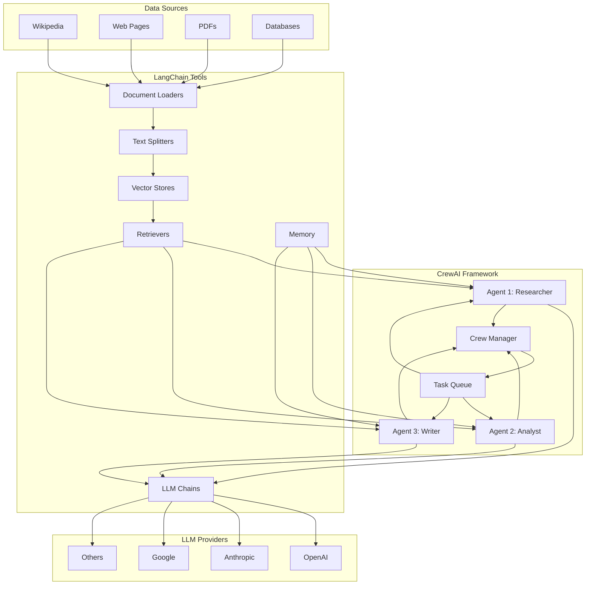
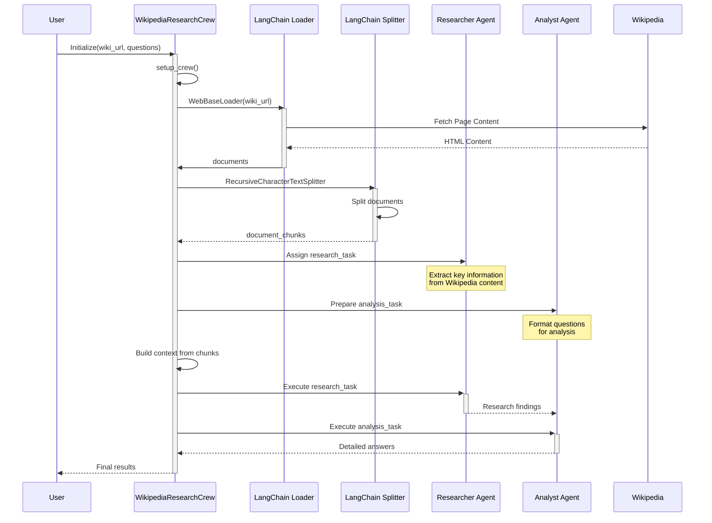

# Using CrewAI with LangChain Tools

## Architecture Diagram



## Integration Flow

1. **Data Ingestion**
   - LangChain document loaders fetch content from various sources (Wikipedia, web pages, etc.)
   - Text splitters break down content into manageable chunks
   - Vector stores index content for efficient retrieval

2. **Agent Setup in CrewAI**
   - Define specialized agents with specific roles (e.g., Researcher, Analyst, Writer)
   - Equip agents with LangChain tools for processing and retrieving information
   - Configure agents with appropriate LLM backends (OpenAI, Anthropic, etc.)

3. **Task Execution**
   - CrewAI Crew Manager orchestrates the workflow between agents
   - Agents use LangChain chains to process information
   - Tasks are delegated based on agent specialization

4. **Information Flow**
   - Retrieved data flows from LangChain retrievers to CrewAI agents
   - Agents process information using LLM-powered reasoning
   - Results are passed between agents through the Crew Manager

## Example Implementation

```python
from crewai import Agent, Task, Crew
from langchain_community.document_loaders import WebBaseLoader
from langchain.text_splitter import RecursiveCharacterTextSplitter
from langchain_openai import ChatOpenAI

# 1. Setup LangChain components
loader = WebBaseLoader("https://en.wikipedia.org/wiki/Artificial_intelligence")
documents = loader.load()
text_splitter = RecursiveCharacterTextSplitter(chunk_size=1000, chunk_overlap=200)
splits = text_splitter.split_documents(documents)

# 2. Initialize LLM
llm = ChatOpenAI(model="gpt-4o")

# 3. Define CrewAI agents
researcher = Agent(
    role="Researcher",
    goal="Extract key information from documents",
    backstory="You are an expert at finding and organizing information",
    verbose=True,
    llm=llm
)

analyst = Agent(
    role="Analyst",
    goal="Analyze information and identify patterns",
    backstory="You excel at making sense of complex information",
    verbose=True,
    llm=llm
)

# 4. Define tasks
research_task = Task(
    description="Review the AI documents and extract key concepts",
    agent=researcher,
    context=str(splits)
)

analysis_task = Task(
    description="Analyze the research findings and identify trends",
    agent=analyst
)

# 5. Create and run the crew
crew = Crew(
    agents=[researcher, analyst],
    tasks=[research_task, analysis_task],
    verbose=2
)

result = crew.kickoff()
```

This architecture allows for powerful AI workflows that combine the multi-agent capabilities of CrewAI with the extensive toolkit provided by LangChain.

## Wikipedia Question Answering Implementation

The `wikipedia_qa.py` script demonstrates a practical implementation of CrewAI with LangChain to create a Wikipedia question-answering system. This implementation showcases how to combine these frameworks to build a specialized knowledge extraction and analysis system.

### Implementation Diagram



### Key Components

1. **Class Structure**
   - The solution is encapsulated in a `WikipediaResearchCrew` class
   - The class manages the entire workflow from content fetching to answer generation

2. **Content Retrieval**
   - Uses LangChain's `WebBaseLoader` to fetch Wikipedia content
   - Implements `RecursiveCharacterTextSplitter` to divide content into manageable chunks
   - Preserves document structure for context-aware processing

3. **Agent Configuration**
   - **Wikipedia Researcher Agent**: Specialized in extracting key information from Wikipedia articles
   - **Content Analyst Agent**: Focused on understanding the extracted information and answering specific questions
   - Both agents are configured with OpenAI's GPT-4o model for advanced reasoning

4. **Task Orchestration**
   - Research task provides the Wikipedia content as context to the researcher agent
   - Analysis task takes the researcher's output and uses it to answer specific questions
   - Tasks are sequentially executed with the output of one feeding into the next

5. **Dynamic Question Handling**
   - Accepts any Wikipedia URL as input
   - Takes a list of user-defined questions about the content
   - Formats questions into the task description for the analyst agent

### Example Usage

The script includes a demonstration that:
1. Targets the Wikipedia article on Artificial Intelligence
2. Asks four specific questions about AI history, approaches, ethics, and industry applications
3. Runs the crew to process the article and generate detailed answers
4. Prints the final results to the console

### Implementation Benefits

- **Separation of Concerns**: Each agent has a specific role in the information processing pipeline
- **Flexible Content Source**: Can be adapted to work with any Wikipedia article
- **Customizable Questions**: Users can specify any questions relevant to their research needs
- **Context-Aware Responses**: The system maintains context throughout the processing chain

This implementation demonstrates how CrewAI's multi-agent orchestration combined with LangChain's document processing capabilities creates a powerful system for extracting and analyzing information from web content.
